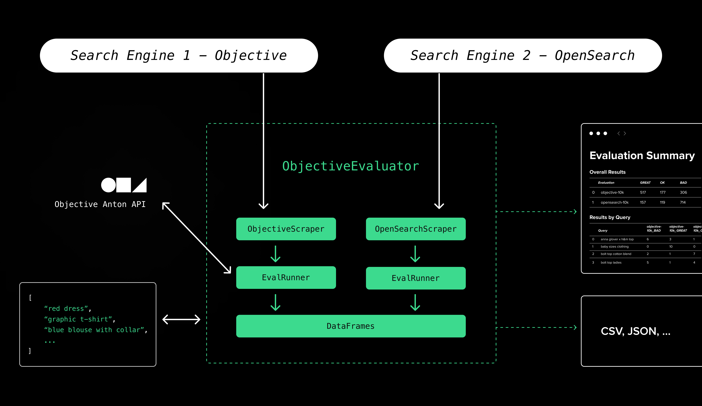

# Objective Search Evaluator

The Objective Search Evaluator (OSE) is a tool that evaluates and compares the quality of search results using Objective's [Anton API](https://www.objective.inc/articles/meet-anton-ai-powered-search-evaluation-in-an-api). OSE is a Python package that is designed to be extended through the concept of "Scrapers". Scrapers are classes that define how to extract search results from a search engine. Then, using one to many "Scrapers", OSE can be used to evaluate and compare the quality of search results across multiple search engines simultaneously.



## Quickstart 

### Setup

1. [Sign up](https://app.objective.inc/sign-up) for an Objective account.
2. Complete the [Quickstart Guide](https://www.objective.inc/docs/quickstart) to create a search index.
3. Start a [free Anton trial](https://app.objective.inc/dashboard/anton).

### Running an evaluation

1. Clone this repository (PyPI package coming soon)
2. Install the dependencies: `pip install -r requirements.txt`
3. Create a `.env` file with the following environment variables (or see `.env.example`):
    - `OBJECTIVE_EVAL_API_KEY` - The [Objective API Key](https://app.objective.inc/dashboard/api-keys) for the account/organization where Anton is enabled.
    - `OBJECTIVE_API_KEY` - The Objective API Key for the organization where the search index you want to evaluate lives (it can be the same as `OBJECTIVE_EVAL_API_KEY` if they are in the same organization).
    - `OBJECTIVE_INDEX_ID` - The ID of the search index you want to evaluate.
4. Run `quickstart.py`: `python src/quickstart.py`

After a few seconds, your terminal should output a summary and a browser window should open displaying detailed results of the evaluation. If not, look for `quickstart_results.html` in your current working directory and open it manually.

Here is an overview of what `quickstart.py` does:

First, it creates an `ObjectiveScraper` using the environment variables defined above:

```python
eval_api_key = os.getenv("OBJECTIVE_EVAL_API_KEY")
objective_api_key = os.getenv("OBJECTIVE_API_KEY")
objective_index_id = os.getenv("OBJECTIVE_INDEX_ID")

objective_scraper = ObjectiveScraper(
    ObjectiveScrapeParams(
        limit=10,
        scrape_id="objective-quickstart",
        api_key=objective_api_key,
        index_id=objective_index_id,
        object_fields="*"
    )
)
```

Then, it creates an `ObjectiveEvaluator`, that we pass the `ObjectiveScraper` to:

```python
evaluator = ObjectiveEvaluator(
    scrapers=[objective_scraper],
    api_key=eval_api_key,
    work_dir="work/"
)
```

Note that the `scrapers` argument accepts a list. This means that you can pass multiple scrapers to the evaluator (see `quickstart_compare.py` for an example).

Next, we define a list of queries to evaluate and run the evaluation:

```python
queries = [
    "red dress",
    "graphic t-shirt",
    "jeans for men",
    "blue blouse with buttons",
    "deep v-neck dress",
    "long sleeve shirt",
    "visible button fly jeans",
    "dropped shoulders top",
    "embroidery dress",
    "ladies flip-flops",
]

evaluator.run(queries, clear_work_dir=True)
```

The `ObjectiveEvaluator` provides a number of methods to analyze and visualize the results of the evaluation. For example, you can print a summary of the results:

```python
evaluator.summary()
```

Or, you can generate an HTML report:

```python
evaluator.full_results_html("quickstart_results.html")
webbrowser.open('file://' + os.path.abspath("quickstart_results.html"), new=2)
```

Or, you can retrieve a DataFrame (or DataFrames) containing the results of the evaluation(s). The `DataFrame.Name` will match `scrape_id` defined in the scraper:

```python
dataframes = evaluator.dfs
for df in evaluator.dfs:
    print(df.Name)
    print(df.head())
```

The `ObjectiveEvaluator` also supports loading existing evaluations from local files: 

```python
evals = ["work/objective-10k_eval.json", "work/opensearch-10k_eval.json"]
evaluator = ObjectiveEvaluator(scrapers=[], api_key='', work_dir="work/")
evaluator.load_eval_results(evals)
```

### Running and comparing multiple evaluations

We've included a script to run and index the same quickstart data to a local OpenSearch instance using Docker. This package also includes an OpenSearch scraper. To run the local OpenSearch instance:

1. Add the `OPENSEARCH_INITIAL_ADMIN_PASSWORD` environment variable to your `.env`. Set the password to anything you like. Make sure this variable is set in your local environment (e.g. `export OPENSEARCH_INITIAL_ADMIN_PASSWORD=password`).
2. Run `docker compose up -d` from the root of the repository. At this point, OpenSearch should be running on `https://localhost:9200`.
3. Run `./opensearch-index.sh` from the root of the repository. At this point, your OpenSearch instance should be ready to use.
4. Run `python src/quickstart_compare.py` from the root of the repository. This will run an evaluation of the Objective index and the local OpenSearch index at the same time. The results will be saved to `quickstart_compare_results.json`.

## Roadmap

- [ ] Proper Python packaging and PyPI release
- [ ] Add more output metrics (e.g. precision, recall, F1, etc.)
- [ ] Add more views for time series (e.g. compare evaluations of the same index over time)

## Implementing a Scraper

To create your own scraper, you need to implement the `BaseScraper` class. `BaseScraper` has one method, `scrape`, which accepts a list of queries and a file path that's used for saving the results of the scrape. For example, here is the ObjectiveScraper. This scraper uses the Objective SDK to retrieve search results from an Objective search index and save them to a local directory:

```python
from typing import List
from objective import Objective
from objective_evaluator.scraper import BaseScraper, ScrapeParams, SearchResults, SearchResultItem

class ObjectiveScrapeParams(ScrapeParams):
    api_key: str
    index_id: str
    object_fields: str

class ObjectiveScraper(BaseScraper):
    def __init__(self, params: ObjectiveScrapeParams):
        super().__init__(params=params)
        self.params = params
    
    def scrape(self, queries: List[str], save_to_path: str) -> None:
        results = SearchResults(items=[])
        client = Objective(api_key=self.params.api_key)

        for query in queries:
            resp = client.indexes.search(
                index_id=self.params.index_id,
                query=query,
                limit=self.params.limit,
                object_fields=self.params.object_fields
            )
            for result in resp.results:
                results.items.append(SearchResultItem(
                    query=query,
                    object=result.object
                ))
        with open(save_to_path, "w") as f:
            f.write(results.to_json())
```